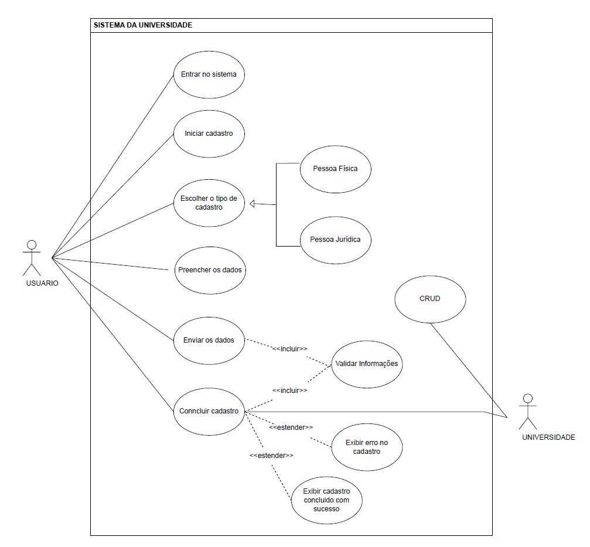
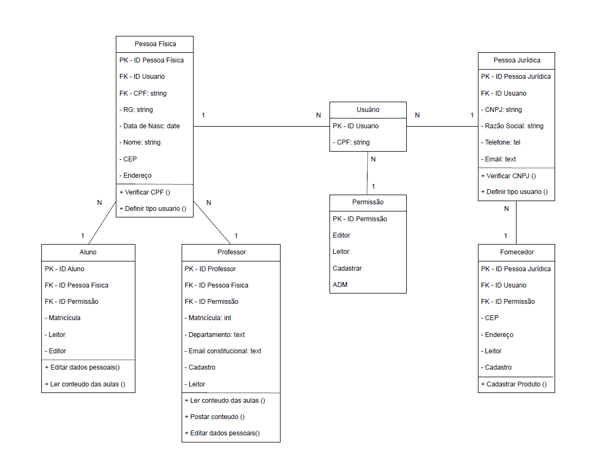
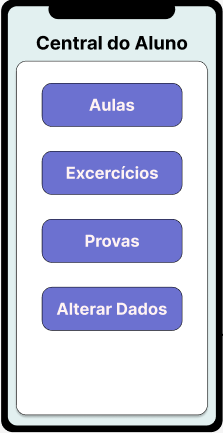
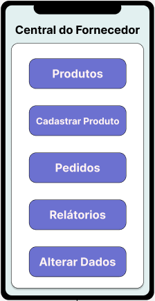
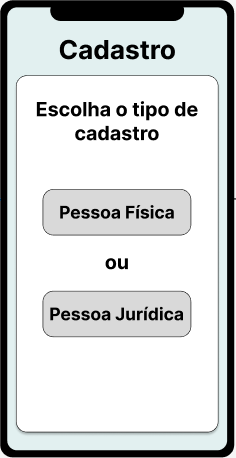
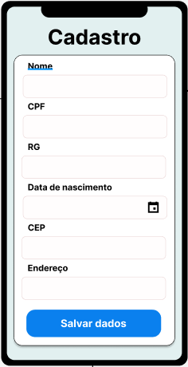
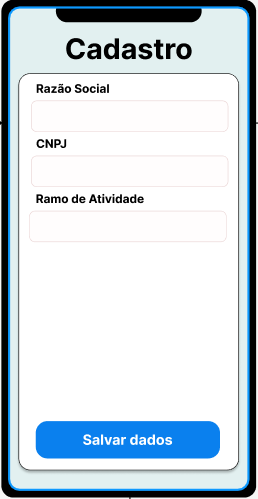
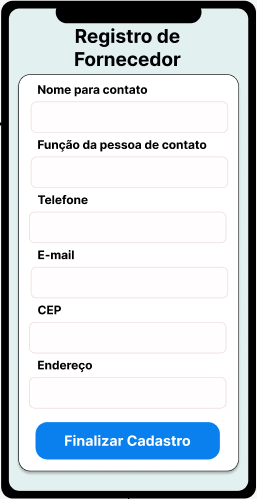
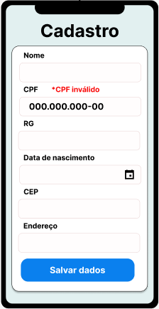
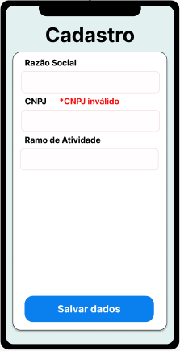

# Projeto Integrador - 3 Semestre

## Integrantes

<ul>
  <li>Carina Fernandes</li>
  <li>Guilherme Bomfim</li>
  <li>Leticia Menezes</li>
  <li>Paulo Henrique</li>
  <li>Rodrigo Soares</li>
</ul>

## Tema: Modelagem de um Sistema Orientado a Objetos​

<ul>
  <li>Cenário: <strong>Sistema universitário</strong> </li>
  <li>Atores: <strong>Usuário e universidade</strong> </li>
  <li>Caso 1: Pessoa Física</li>
  <li>Caso 2: Pessoa Jurídica</li>
  <li>Caso 3: Professor</li>
  <li>Caso 4: Aluno</li>
  <li>Caso 5: Fornecedor</li>
</ul>

## Diagrama de Casos de Uso

________________________________________________________________________________________

## Diagrama de Classes

________________________________________________________________________________________

# Telas do Projeto

## 1 - Tela de Login

________________________________________________________________________________________

## 2 - Login feito com Sucesso

<ol>
  <li>Login de Aluno</li>
  <li>Login de Professor</li>
  <li>Login de Fornecedor</li>
</ol>

  

________________________________________________________________________________________

## 3 - Tela de escolha: Tipo de cadastro

________________________________________________________________________________________

## 4 - Cadastro de Pessoa Física: Tela de Cadastro

________________________________________________________________________________________

## 5 - Cadastro de Aluno ou Professor
  

________________________________________________________________________________________

## 6 - Cadastro de Pessoa Jurídica: Tela de Cadastro

________________________________________________________________________________________

## 7 - Cadastro de Fornecedor

________________________________________________________________________________________

## 8 - Cadastro feito com sucesso 

________________________________________________________________________________________

# Erros previstos  

## Erro de Login

<ol>
  <li>Email ou senha incorretos</li>
  <li>CPF inválido</li>
  <li>CNPJ inválido</li>
  <li>Senha alterada</li>
</ol>

    

________________________________________________________________________________________

## Erro de Cadastro

<ol>
  <li>Pessoa Física -> CPF inválido</li>
  <li>Pessoa Jurídica -> CNPJ inválido</li>
</ol>

 

________________________________________________________________________________________
