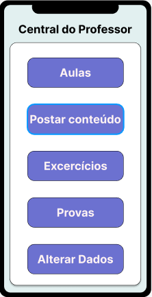
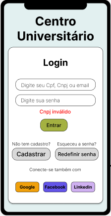

# Projeto Integrador - 3 Semestre

## Integrantes

<ul>
  <li>Carina Fernandes</li>
  <li>Guilherme Bomfim</li>
  <li>Leticia Menezes</li>
  <li>Paulo Henrique</li>
  <li>Rodrigo Soares</li>
</ul>

## Tema: Modelagem de um Sistema Orientado a Objetos​

<ul>
  <li>Cenário: <strong>Sistema universitário</strong> </li>
  <li>Atores: <strong>Usuário e universidade</strong> </li>
  <li>Caso 1: Pessoa Física</li>
  <li>Caso 2: Pessoa Jurídica</li>
  <li>Caso 3: Professor</li>
  <li>Caso 4: Aluno</li>
  <li>Caso 5: Fornecedor</li>
</ul>

## Diagrama de Casos de Uso

________________________________________________________________________________________

## Diagrama de Classes

________________________________________________________________________________________

# Telas do Projeto - Login

## 1 - Tela de Login - Aluno
 

________________________________________________________________________________________

## 2 - Tela de Login - Professor
 

________________________________________________________________________________________

## 3 - Tela de Login - Fornecedor
 

________________________________________________________________________________________

## 4 - Tela de Login - Erro Email ou Senha

________________________________________________________________________________________

## 5 - Tela de Login - Erro CPF

________________________________________________________________________________________

## 6 - Tela de Login - Erro CNPJ

________________________________________________________________________________________

## 7 - Tela de Login - Senha alterada a X dias

________________________________________________________________________________________

# Telas do Projeto - Cadastro

## 1 - Cadastro de Pessoa Física - Aluno
      

________________________________________________________________________________________

## 2 - Cadastro de Pessoa Física - Professor
      

________________________________________________________________________________________

## 3 - Cadastro de Pessoa Jurídica - Fornecedor
     

________________________________________________________________________________________

## 4 - Cadastro de Pessoa Física - Erro CPF
   

________________________________________________________________________________________

## 5 - Cadastro de Pessoa Jurídica - Erro CPNJ
   

________________________________________________________________________________________
